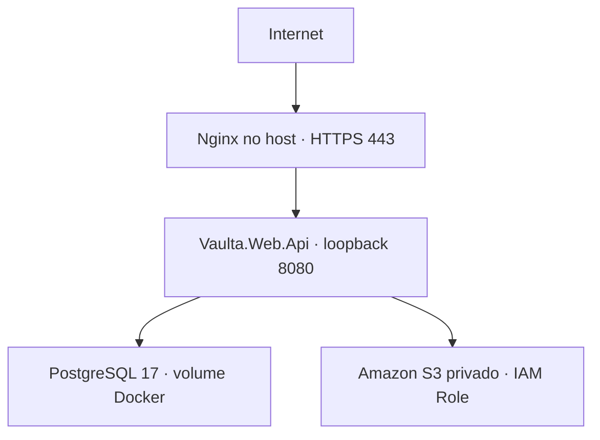

# AWS Production / MVP

Esta entrega prepara o repositório; não provisiona, altera ou implanta recursos AWS. A validação contra a conta real deve ser executada pelo operador depois do review. O compose local permanece `docker compose up --build`, incluindo MinIO. Nunca combine o compose local com o de produção usando dois `-f`: isso pode herdar portas e credenciais locais.



O monólito modular .NET 10 mantém Identity, Catalog, Collection, Assets e Outbox. API e banco compartilham a rede bridge do Compose. PostgreSQL não publica portas; API publica somente `127.0.0.1:8080`. Nginx existente no host é o ingresso externo em 80/443. Não há RDS, balanceador, broker, cache distribuído ou nova infraestrutura paga.

| Recurso informado | Valor |
|---|---|
| Região | `us-east-1` |
| EC2 | `i-0e57271cbb9d8a6b2`, `t3a.micro`, Amazon Linux |
| Endereço público informado | `34.197.51.51` |
| Disco / memória | 20 GB gp3 / ~1 GB RAM + 2 GB swap |
| ECR | `142767402064.dkr.ecr.us-east-1.amazonaws.com/vaulta-api` |
| S3 | `vaulta-assets-142767402064-us-east-1` |
| Budget informado | US$ 25/mês; alerta de orçamento não limita gastos automaticamente |

## Configuração e secrets

Copie `.env.production.example` para `.env.production`. Os scripts usam esse arquivo apenas como entrada de interpolação do Compose, nunca `source`. A API recebe somente a lista explícita de variáveis no compose, não todo o arquivo. O `.env` local continua independente. `.env*` reais, `.deploy/`, dumps e chaves privadas são ignorados por Git e pelo contexto Docker.

| Variável do arquivo | Configuração efetiva | Origem / secreta? |
|---|---|---|
| `POSTGRES_DB` | database em `ConnectionStrings__Vaulta` e PostgreSQL | `vaulta`, não |
| `POSTGRES_USER` | username em `ConnectionStrings__Vaulta` e PostgreSQL | `vaulta`, não |
| `POSTGRES_PASSWORD` | password em `ConnectionStrings__Vaulta` e PostgreSQL | gerar aleatória, **sim** |
| `JWT_SECRET` | `Jwt__Secret` | gerar aleatória independente, **sim**, mínimo 32 bytes |
| `JWT_ISSUER` | `Jwt__Issuer` | `vaulta`, não |
| `JWT_AUDIENCE` | `Jwt__Audience` | `vaulta-app`, não |
| `ASSETS_BUCKET` | `Assets__S3__Bucket` | bucket AWS acima, não |
| `AWS_REGION` | `Assets__S3__Region` e `AWS_REGION` | `us-east-1`, não |
| `PROXY_GATEWAY` | gateway Docker e `ReverseProxy__KnownProxies__0` | `172.30.42.1`, não |
| `DOCKER_SUBNET` | subnet Docker | `172.30.42.0/24`, não |
| `CORS_ORIGIN_0`, `CORS_ORIGIN_1` | `Cors__Origins__0`, `Cors__Origins__1` | HTTPS explícito ou vazio, não |
| `AUTH_PERMIT_LIMIT` | `RateLimit__AuthPermitLimit` | 20/minuto/IP por padrão, não |
| `IMAGE_TAG` | imagem ECR | SHA imutável, argumento do deploy ou último deploy saudável |

Os scripts aceitam senha PostgreSQL em hex/base64 com pelo menos 32 caracteres; isso evita injeção na connection string por `;`, aspas ou quebras de linha. Banco e usuário devem usar identificadores simples. Use segredos gerados, não frases previsíveis. Não imprima `docker compose config`, `docker inspect .Config.Env`, dumps ou arquivos `.env` em tickets/logs.

`appsettings.Production.json` contém somente bucket, região, path style e migrations desativadas. O host valida a configuração efetiva **antes de migrations e comandos de Catalog**, além da validação atual do JWT. Production recusa secrets curtos/placeholders, campos essenciais ausentes, endpoint S3 customizado, chaves AWS estáticas, path style, migrations automáticas, Outbox desativado e origins CORS inválidas. Development/Testing mantêm o caminho MinIO com AccessKey + SecretKey; uma única chave configurada é erro.

## Pré-requisitos da infraestrutura existente

Confirmar antes do primeiro deploy; nenhuma destas verificações foi aplicada à AWS por esta mudança:

- Docker Engine atual, Compose v2 com `up --wait`, AWS CLI v2, Python 3, curl, gzip e flock no host. O usuário de operação precisa acessar Docker e `/opt/vaulta`. Docker instalado sozinho não garante que o plugin Compose exista.
- Role da EC2 com ECR pull (`ecr:GetAuthorizationToken`, `BatchGetImage`, `GetDownloadUrlForLayer`, `BatchCheckLayerAvailability`), S3 `GetObject`/`PutObject` nos prefixes de assets e `PutObject` em `backups/postgres/*`. Restore/listagem precisam de `GetObject`/`ListBucket` correspondentes. Não é necessário tornar o bucket público nem dar `s3:*`.
- S3 Block Public Access ativo; sem ACL/policy pública. Backup usa SSE-S3. Caso a policy atual exija KMS, revisar permissões e criptografia antes de usar os scripts.
- **IMDS endpoint habilitado, IMDSv2 obrigatório e response hop limit 2** para a role chegar a containers bridge. Hop limit 1 pode permitir AWS CLI no host e bloquear o SDK no container. O compose desativa fallback IMDSv1 (`AWS_EC2_METADATA_V1_DISABLED=true`). Não configure keys como workaround; resolver a configuração de metadata exige uma tarefa de infraestrutura separada.
- Somente Nginx 80/443 liberados publicamente; nenhuma regra pública para 5432/8080. Prefira SSM para operação. Não se verificou o Security Group nesta tarefa.
- Verificar `ip route` e redes Docker antes de usar a subnet proposta; se houver conflito, alterar `DOCKER_SUBNET` e `PROXY_GATEWAY` juntos antes do primeiro deploy.
- Domínio e certificado HTTPS válidos ainda precisam ser definidos. O IP fornecido não prova que exista Elastic IP/reserva permanente.

A aplicação usa `new AmazonS3Client(config)` sem credenciais quando ambas as chaves estão ausentes. O SDK descobre e renova as credenciais temporárias da role. Não há cliente STS, lógica AWS de autenticação própria ou arquivo de credenciais montado na imagem. O helper `aws_role` dos scripts remove variáveis/perfis de credenciais do AWS CLI e usa IMDSv2; não grava access keys.

## Build e push ECR (máquina de desenvolvimento / CI futuro)

Requer Docker, SDK .NET 10 e uma sessão AWS federada/SSO com permissão de **push**, separada da role de pull da EC2. Autentique pelo fluxo AWS SSO já usado pela equipe (`aws sso login --profile <perfil>`), sem criar keys estáticas.

Na raiz do checkout aprovado, com working tree limpa:

```bash
set -euo pipefail
for project in tests/*/*.csproj; do dotnet test "$project"; done
python3 -m unittest discover -s tests/operations -v
TAG=$(git rev-parse HEAD)
ECR=142767402064.dkr.ecr.us-east-1.amazonaws.com/vaulta-api
docker build --platform linux/amd64 -f src/Vaulta.Web.Api/Dockerfile -t vaulta-api:test .
./scripts/smoke-production-container.sh
docker tag vaulta-api:test "$ECR:$TAG"
aws ecr get-login-password --region us-east-1 | docker login --username AWS --password-stdin 142767402064.dkr.ecr.us-east-1.amazonaws.com
docker push "$ECR:$TAG"
docker logout 142767402064.dkr.ecr.us-east-1.amazonaws.com
printf 'Deploy tag: %s\n' "$TAG"
```

Use `AWS_PROFILE` quando a sessão SSO tiver nome. Tags SHA devem ser publicadas uma vez e nunca sobrescritas. Não houve alteração de tag mutability/lifecycle do ECR. Não construa imagem na t3a.micro; o host só faz pull e executa. A solution inclui MAUI: `dotnet test Vaulta.slnx` exige os workloads móveis; o loop acima executa todos os projetos de teste backend sem instalá-los.

O smoke Docker usa um projeto/volume **descartável**, porta local 8080 e subnet padrão. Execute somente em um host de testes livre, nunca na EC2 de produção. Remove exclusivamente os volumes do projeto `vaulta-production-smoke`. Ele migra PostgreSQL real, inicia Production, testa health/proxy/Swagger, reinicia, confirma persistência, faz dump/restore em banco descartável. Não precisa nem usa AWS; S3 real permanece validação operacional posterior.

O workflow `Catalog validation` agora cobre Assets/Identity e os arquivos operacionais. Executa testes backend (incluindo PostgreSQL + MinIO Testcontainers), scripts, Docker build e smoke Production. Não faz push ECR nem deploy. Automação futura deve usar GitHub OIDC e uma role de escopo mínimo, sem GitHub secrets contendo keys AWS.

## Primeiro deploy na EC2

Obtenha o checkout aprovado em `/opt/vaulta` e use o usuário de operação (`ec2-user` nos templates):

```bash
cd /opt/vaulta
umask 077
cp .env.production.example .env.production
python3 - <<'PY'
from pathlib import Path
import secrets
p = Path('.env.production')
s = p.read_text().replace('POSTGRES_PASSWORD=\n', 'POSTGRES_PASSWORD=' + secrets.token_hex(32) + '\n')
s = s.replace('JWT_SECRET=\n', 'JWT_SECRET=' + secrets.token_hex(48) + '\n')
p.write_text(s)
p.chmod(0o600)
PY
./scripts/deploy-production.sh <SHA_PUBLICADO_NO_ECR>
curl --fail http://127.0.0.1:8080/health
curl --fail http://127.0.0.1:8080/health/ready
```

O bloco de geração é **somente para o primeiro provisionamento do arquivo**; não sobrescreva `.env.production` existente. Alterar `POSTGRES_PASSWORD` não altera a senha do usuário num volume PostgreSQL já inicializado; rotação exige procedimento explícito no banco e na API. O usuário do banco é o inicializador PostgreSQL e tem privilégios amplos neste MVP; separar runtime/DDL é uma melhoria futura, não um requisito oculto para este compose.

O deploy valida secrets sem exibi-los, adquire lock local, autentica no ECR via role, faz pull, inicia/aguarda o banco sem recriá-lo, executa `compose run --rm --no-deps vaulta-api --migrate`, e só então recria a API e aguarda readiness. Login Docker fica em diretório temporário privado, removido no fim. Em erro são mostrados estágio, status e últimas 60 linhas dos logs.

**Se migration falhar, a API anterior não é substituída.** As migrations de quatro DbContexts não são uma única transação global; um módulo já aplicado pode permanecer atualizado se outro falhar. Novas migrations devem ser compatíveis com a versão anterior (expand/contract). Não basta preservar o container para garantir compatibilidade de schema. Antes de migrations com dados reais, faça backup e revise compatibilidade.

## Nginx, TLS, forwarded headers e CORS

Prepare `deploy/nginx/vaulta.conf.example` com domínio/certificado reais. Depois de revisão operacional, instale em `/etc/nginx/conf.d/vaulta.conf`, execute `sudo nginx -t` e recarregue com `sudo systemctl reload nginx`. Esses comandos não são executados pelos scripts de deploy do repositório.

O template sobrescreve `X-Forwarded-For` com `$remote_addr` e `X-Forwarded-Proto` com `$scheme`; não reaproveita valores enviados por clientes. ASP.NET confia apenas nos loopbacks e no gateway individual configurado, com limite de um hop e simetria dos headers. Não limpe as listas de confiança sem repovoá-las. `UseForwardedHeaders()` vem antes de HSTS, redirecionamento, auth e rate limiter. Não configure `ASPNETCORE_FORWARDEDHEADERS_ENABLED=true`, que pode introduzir configuração automática mais permissiva.

Somente `/health` e `/health/ready` exatos aceitam HTTP para probes locais; endpoints de negócio continuam redirecionando para HTTPS. Swagger continua exclusivo de Development. A readiness testa conectividade PostgreSQL, **não** credenciais S3 nem presença de todas as tabelas. A etapa `--migrate` é obrigatória.

Para browser, preencha `CORS_ORIGIN_0=https://app.seudominio.com` (sem trailing slash) e, se necessário, a segunda origem; mais origens podem ser adicionadas ao mapeamento do compose como `Cors__Origins__2`. Vazio mantém CORS fechado; nunca use `*`. MAUI com HTTP nativo não exige CORS. Upload direto de um frontend web também exige CORS **no bucket** permitindo apenas suas origins e PUT/GET/Content-Type; esse ajuste AWS está fora desta tarefa.

## Deploy seguinte e rollback

Depois de testar e publicar outra tag:

```bash
cd /opt/vaulta
./scripts/backup-postgres.sh
./scripts/deploy-production.sh <NOVA_SHA>
```

Mantenha no host o compose/scripts compatíveis com a versão implantada. O script grava `.deploy/current-tag` somente após health/readiness e mantém `.deploy/previous-tag`. O wrapper usa a tag saudável atual automaticamente:

```bash
./scripts/production-compose.sh ps
./scripts/production-compose.sh logs -f vaulta-api
./scripts/production-compose.sh logs -f postgres
```

Rollback explícito, apenas para schema compatível com a imagem anterior:

```bash
./scripts/deploy-production.sh <SHA_ANTERIOR_COMPATIVEL>
# Ou após um deploy bem-sucedido, quando previous-tag foi conferida:
./scripts/deploy-production.sh "$(cat .deploy/previous-tag)"
```

Não existe down-migration automática. O rollback repete a etapa idempotente de migrations da imagem escolhida; não desfaz migrations já aplicadas. Se o novo container falhar depois da migration, o último registro saudável fica preservado, mas a API nova pode estar indisponível: execute rollback explicitamente após verificar schema. Não há blue/green nem zero downtime; a substituição tem pequena janela de indisponibilidade.

## Backup diário e restore

```bash
cd /opt/vaulta
./scripts/backup-postgres.sh
```

Gera `pg_dump --no-owner --no-acl | gzip` em diretório temporário privado, verifica o gzip e só então envia para `s3://vaulta-assets-142767402064-us-east-1/backups/postgres/YYYYMMDDTHHMMSSZ.sql.gz`, com SSE-S3 e sem ACL pública. `pipefail` impede upload de dump parcial. A senha fica no ambiente do processo dentro do container; não vai na linha de comando nem nos logs. Deploy e backup usam o mesmo lock. O dump temporário é removido ao terminar. É backup lógico do banco inteiro (todos os schemas), não inclui roles globais nem objetos S3.

Templates opcionais de systemd (revise usuário, PATH da AWS CLI/Docker e `/opt/vaulta` antes):

```bash
sudo install -m 644 deploy/systemd/vaulta-postgres-backup.service /etc/systemd/system/
sudo install -m 644 deploy/systemd/vaulta-postgres-backup.timer /etc/systemd/system/
sudo systemctl daemon-reload
sudo systemctl enable --now vaulta-postgres-backup.timer
systemctl list-timers vaulta-postgres-backup.timer
journalctl -u vaulta-postgres-backup.service --since yesterday
```

Timer diário às 03:00 UTC (00:00 de São Paulo), com até 15 minutos de atraso aleatório. Alternativa cron do usuário de operação: `0 0 * * * cd /opt/vaulta && ./scripts/backup-postgres.sh` se o host usar timezone São Paulo. Escolha um agendador, não ambos. Falha de backup deve ser acompanhada no journal; não há serviço externo de alertas novo.

Restore de ensaio recomendado para **outro banco**, preservando o atual:

```bash
cd /opt/vaulta
umask 077
mkdir -p backups
# Substitua pelo nome exato de um backup existente.
BACKUP=YYYYMMDDTHHMMSSZ.sql.gz
# Use a IAM Role no host, sem perfis/keys estáticos.
aws s3 cp "s3://vaulta-assets-142767402064-us-east-1/backups/postgres/$BACKUP" "backups/$BACKUP" --region us-east-1 --only-show-errors
gzip -t "backups/$BACKUP"
./scripts/production-compose.sh exec -T postgres sh -eu -c 'createdb -U "$POSTGRES_USER" vaulta_restore'
set -o pipefail
gunzip -c "backups/$BACKUP" | ./scripts/production-compose.sh exec -T postgres sh -eu -c 'psql -v ON_ERROR_STOP=1 -U "$POSTGRES_USER" -d vaulta_restore' > backups/restore.log
./scripts/production-compose.sh exec -T postgres sh -eu -c 'psql -U "$POSTGRES_USER" -d vaulta_restore -c "SELECT count(*) FROM identity.users;"'
```

Para recuperação real, pause gravações/paralise o timer, pare a API e processos de Catalog, faça backup do estado atual e restaure primeiro em `vaulta_restore`. Após validar dados e compatibilidade da imagem, ajuste `POSTGRES_DB=vaulta_restore` no arquivo protegido. Recrie o container PostgreSQL **mantendo o volume** para atualizar seu ambiente (`./scripts/production-compose.sh up -d --force-recreate --wait postgres`), e execute deploy da tag compatível. A inicialização num volume existente não apaga nem recria dados; o novo banco já deve existir. Reinicie o timer e confirme que o próximo dump usa o novo banco. Isso é uma operação deliberada com downtime; não faça `down -v`, `dropdb` ou restore destrutivo no banco em uso.

Backups diários têm RPO de até ~24 horas e recuperação manual. Verifique periodicamente um restore real. Dumps usam espaço temporário no disco de 20 GB; acompanhe disco, crescimento de banco/Outbox e backup. Retenção S3 não foi alterada: definir lifecycle limitado ao prefixo `backups/postgres/` é uma pendência operacional para conter custo; nunca aplicar expiração a assets de usuários por engano.

## Catalog e Assets

Sync permanece comando temporário, sem iniciar segunda API permanente:

```bash
./scripts/production-compose.sh run --rm --no-deps vaulta-api --catalog-sync tcgdex base1
./scripts/production-compose.sh run --rm --no-deps vaulta-api --catalog-sync-runs
./scripts/production-compose.sh run --rm --no-deps vaulta-api --catalog-sync-run <RUN_GUID>
```

Defaults preservados: `/v2/`, `en`, timeout 30s, concorrência 4, retries 3, atraso máximo 60s. Prefira um set; evite sync `all` simultâneo com deploy/backup numa micro. O lock do provider continua PostgreSQL; morte abrupta pode deixar SyncRun em `running` para investigação.

O fluxo privado continua `CreateUpload → presigned PUT → Confirm → Attach → GET do item com presigned GET`. URLs expiram (PUT 10 min / GET 5 min), não são persistidas como URLs públicas. Credenciais temporárias podem encurtar a validade efetiva da assinatura. Não há mudança na validação de ownership ou no lifecycle do Assets.

Validação AWS posterior, após HTTPS, permissões e catálogo estarem prontos:

```bash
python3 scripts/smoke-assets.py https://api.seudominio.com <PRINTING_ID_ATIVA>
```

O script solicita email/senha de conta dedicada, grava **um item e um asset real**, verifica upload/confirm/attach/leitura e nega leitura sem assinatura. Não imprime senha, token ou URLs assinadas. Não foi executado nesta tarefa. Os testes automatizados equivalentes usam PostgreSQL + MinIO reais e testes de assinatura com credenciais temporárias fictícias; não provam IAM/S3 da conta real.

## Operação e troubleshooting

```bash
docker ps
./scripts/production-compose.sh ps
./scripts/production-compose.sh logs --tail 100 vaulta-api
./scripts/production-compose.sh logs --tail 100 postgres
df -h
free -h
swapon --show
docker system df
curl --fail http://127.0.0.1:8080/health
curl --fail http://127.0.0.1:8080/health/ready
ss -lnt
aws sts get-caller-identity --region us-east-1
aws s3api head-bucket --bucket vaulta-assets-142767402064-us-east-1 --region us-east-1
aws s3 ls s3://vaulta-assets-142767402064-us-east-1/backups/postgres/ --region us-east-1
aws ecr get-login-password --region us-east-1 | docker login --username AWS --password-stdin 142767402064.dkr.ecr.us-east-1.amazonaws.com
```

Logs ASP.NET continuam JSON; ambos os serviços usam Docker json-file com rotação `10m × 5`. Não há stack de observabilidade nova. Logs e dumps ficam restritos aos operadores; não publique diagnósticos contendo configurações resolvidas. Remova imagens antigas deliberadamente após confirmar tags necessárias ao rollback; não execute prune de volumes. Nginx/journald precisam manter a rotação do host configurada.

- **Redirect loop / IP único no limiter:** conferir gateway real com `docker network inspect vaulta-production_backend`, headers sobrescritos no Nginx e `ReverseProxy__KnownProxies__0`. Não liberar qualquer proxy para contornar o problema.
- **S3 sem credenciais no container, mas CLI funciona:** verificar IMDSv2/hop limit e rota/firewall para metadata, além de IAM role. Não imprimir endpoints de credenciais IMDS. `head-bucket` sozinho não prova PutObject/GetObject; usar o smoke autorizado.
- **S3 403:** checar ARN/prefixo permitido, Block Public Access, policy exigindo KMS, relógio do host e expiração de URL/credenciais. Não conceder acesso público.
- **PostgreSQL unhealthy:** verificar logs, volume, memória e disco. `pg_isready` testa disponibilidade, não valida senha; migration faz conexão autenticada.
- **Migration falhou:** API anterior preservada; investigar módulo/SQL e compatibilidade, repetir a mesma tag após corrigir a causa. Nunca editar migrations já aplicadas.
- **OOM / disco cheio:** ver `docker stats --no-stream`, `free -h`, `df -h`, logs e imagens. Limites atuais são iniciais (PG 256 MiB, API 384 MiB, swap adicional); medir com carga antes de ampliar uso.
- **Sem `.deploy/current-tag`:** antes do primeiro deploy, use `IMAGE_TAG=<SHA> ./scripts/production-compose.sh ...`.

## Limites e aceite

A aceitação AWS completa depende de execução posterior autorizada: push ECR, role/IMDS no container real, HTTPS, upload S3, backup S3, portas externas e rollback. Esta tarefa não verifica nem modifica AWS. A micro e um único disco são pontos únicos de falha; volume Docker preserva reinícios, não perda do EBS/instância. O banco e a API compartilham recursos. Backup diário não oferece PITR. O limite do Budget não garante que o custo fique abaixo de US$ 25.

Referências de implementação: [AWS credential resolution v4](https://docs.aws.amazon.com/sdk-for-net/v4/developer-guide/creds-assign.html), [IMDS em containers](https://docs.aws.amazon.com/AWSEC2/latest/UserGuide/instancedata-data-retrieval.html), [ASP.NET Core trusted proxies](https://learn.microsoft.com/en-us/aspnet/core/host-and-deploy/proxy-load-balancer?view=aspnetcore-10.0).
