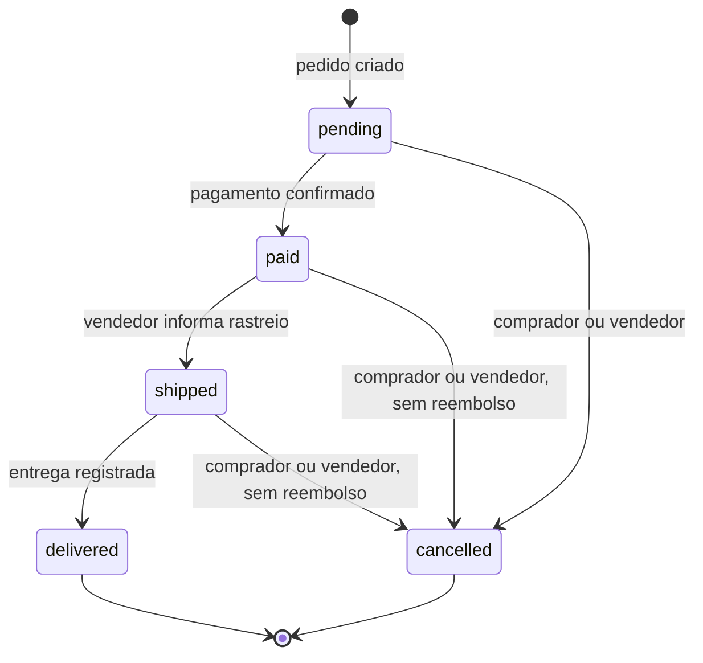

# Regras de negócio do Vaulta

> **Retrato do código em `master` @ `0d509f4` (30/09/2026).** Este documento descreve as regras que o código aplica **hoje**, não as desejadas. Quando README, ADRs e código divergem, vale o código. As divergências conhecidas e as decisões em aberto estão na [seção 16](#16-lacunas-divergências-e-pontos-a-decidir). Cada regra indica o arquivo (e, quando ajuda, o símbolo) de onde vem.

## Sumário

1. [Visão geral](#1-visão-geral)
2. [Convenções transversais](#2-convenções-transversais)
3. [Identity: contas, perfil e sessão](#3-identity-contas-perfil-e-sessão)
4. [Catalog: catálogo canônico](#4-catalog-catálogo-canônico)
5. [Scanner: reconhecimento de cartas](#5-scanner-reconhecimento-de-cartas)
6. [Collection: coleção do usuário](#6-collection-coleção-do-usuário)
7. [Assets: upload de imagens](#7-assets-upload-de-imagens)
8. [Marketplace: vendedores e anúncios](#8-marketplace-vendedores-e-anúncios)
9. [Orders: reserva e pedido](#9-orders-reserva-e-pedido)
10. [Payments: cobrança via Asaas](#10-payments-cobrança-via-asaas)
11. [Shipping: envio](#11-shipping-envio)
12. [Wallets: carteira](#12-wallets-carteira)
13. [Reviews: avaliações](#13-reviews-avaliações)
14. [Regras aplicadas no app](#14-regras-aplicadas-no-app)
15. [Máquinas de estado](#15-máquinas-de-estado)
16. [Lacunas, divergências e pontos a decidir](#16-lacunas-divergências-e-pontos-a-decidir)
17. [Como manter este documento](#17-como-manter-este-documento)

---

## 1. Visão geral

O Vaulta é um app mobile (.NET MAUI) com uma API (.NET 10, ASP.NET Core e PostgreSQL) para colecionadores brasileiros de TCG. Com ele o usuário:

- consulta um catálogo canônico de cartas (hoje só **Pokémon**, sincronizado do TCGdex);
- registra a coleção física, cópia a cópia, inclusive fotografando a carta (scanner);
- compra e vende cartas de outros usuários. O fluxo inclui pagamento pelo Asaas, envio, carteira do vendedor e avaliação mútua.

A API é um monólito modular. Cada módulo tem as camadas Domain, Application, Infrastructure e Contracts e um schema próprio no banco. A arquitetura está descrita em [architecture.md](architecture.md).

### Atores

| Ator | Quem é | O que pode fazer |
|---|---|---|
| Visitante | Sem login | Cadastrar-se, entrar, buscar no catálogo, ver a vitrine e perfis públicos |
| Usuário | Qualquer conta logada | Tudo acima, mais coleção, scanner, uploads, carteira, comprar e avaliar |
| Vendedor | Usuário que habilitou o perfil de vendedor | Criar e gerenciar anúncios, registrar envios |
| Comprador | Usuário que criou um pedido | Pagar, cancelar e avaliar o pedido |
| Operador | Quem tem acesso ao servidor | Rodar pela linha de comando a sincronização do catálogo e o seed do admin |

> **Não existem papéis (roles).** Toda rota protegida só exige que o usuário esteja logado. Contas `PendingVerification` podem tudo o que contas `Active` podem, e o usuário "admin" criado pelo seed é uma conta comum.

### Módulos

| Módulo | Responsabilidade |
|---|---|
| Identity | Contas, perfil, preferências, sessão (JWT + refresh token) e o outbox de eventos |
| Catalog | Catálogo canônico, sincronização com o TCGdex e scanner |
| Collection | Coleção do usuário (entradas e itens físicos) |
| Assets | Upload de imagens para o S3 por URL pré-assinada |
| Marketplace | Perfil de vendedor, anúncios e vitrine |
| Orders | Reserva e pedido |
| Payments | Cobrança no Asaas e webhook |
| Shipping | Envio e rastreio |
| Wallets | Carteira (saldo e extrato) e saque |
| Reviews | Avaliação entre comprador e vendedor |

### Glossário (termo no código → termo neste documento)

| Código | Documento |
|---|---|
| `Printing` | impressão: a carta publicada num set, com número e idioma |
| `Variant` | variante: acabamento da impressão (normal, holo, reverse…) |
| `CollectionEntry` | entrada da coleção |
| `CollectibleItem` | item: uma cópia física |
| `Listing` | anúncio |
| `Order` / `Reservation` | pedido / reserva |
| `PaymentTransaction` | pagamento |
| `Shipment` | envio |
| `Wallet` | carteira |
| `Review` | avaliação |

### Fluxo ponta a ponta (como foi desenhado)

1. O usuário se cadastra, e uma carteira com saldo 0 é criada automaticamente.
2. Ele adiciona cartas à coleção, à mão ou pelo scanner.
3. Habilita o perfil de vendedor e anuncia um item da coleção, com fotos.
4. Um comprador cria um pedido. O anúncio é reservado e marcado como vendido.
5. O comprador paga (PIX, cartão ou boleto) pelo Asaas.
6. Com o pedido pago, o vendedor registra o envio e o código de rastreio.
7. A entrega é registrada, e o pedido fica `delivered`.
8. Comprador e vendedor podem se avaliar.

> Esse fluxo ainda não funciona inteiro. Hoje, por exemplo, nenhum item consegue ser anunciado, e o saldo do vendedor nunca é creditado. Detalhes na [seção 16](#16-lacunas-divergências-e-pontos-a-decidir).

---

## 2. Convenções transversais

### 2.1 Dinheiro

- **Formato:** valores em `decimal`, arredondados para 2 casas com `Math.Round(x, 2)`. No .NET esse arredondamento é bancário: o meio vai para o par.
- **Moeda:** o fluxo comercial (anúncio, pedido, pagamento, envio e carteira) usa só **BRL**, fixo no código.
- **Tipo `Money`:** valor mais moeda de 3 letras, sem lista fechada de moedas. Só é usado no preço de aquisição da coleção.
- **Taxa da plataforma:** **8%** (`MarketplaceRules.PlatformCommissionRate`).

Fontes: [Primitives.cs](../src/Vaulta.SharedKernel/Primitives.cs), [MarketplaceRules.cs](../src/Modules/Marketplace/Vaulta.Marketplace.Domain/MarketplaceRules.cs).

### 2.2 Concorrência otimista

Os registros que podem ser alterados em paralelo têm um `Version` (Guid), que muda a cada alteração. Para alterar, o cliente envia a versão que leu:

- **Perfil e preferências:** header `If-Match` com o ETag de `GET /api/v1/me`.
- **Itens da coleção, anúncios e perfil de vendedor:** campo ou parâmetro `version`.

Se a versão estiver desatualizada, a resposta é **409**, e o cliente deve recarregar e tentar de novo.

### 2.3 Idempotência

Só `POST /api/v1/me/collection/items` exige `Idempotency-Key` (ver [6.4](#64-idempotência)). Pedido, pagamento e saque **não** são idempotentes: repetir a requisição pode duplicar o efeito ou falhar.

### 2.4 Erros

| Situação | HTTP |
|---|---|
| Validação (`ValidationException`), regra de domínio (`DomainException`), requisição malformada | 400 |
| `UnauthorizedException` (credencial ou sessão inválida) | 401 |
| `ForbiddenException` | 403 |
| `NotFoundException` | 404 |
| `ConflictException`, versão desatualizada | 409 |
| Qualquer outra exceção, inclusive violação de índice único não tratada | 500 |

- **Formato:** o corpo é um ProblemDetails. `title` traz a mensagem da regra (em inglês), `errors` detalha cada campo em erros de validação, e todo erro tem `correlationId`.
- **Campo desconhecido:** JSON com um campo que a API não conhece é recusado com 400.
- **Recurso de outro usuário:** a resposta costuma ser **404**, e não 403, para não revelar que o recurso existe.

Fontes: [ApiExceptionHandler.cs](../src/Vaulta.Web.Api/ApiExceptionHandler.cs), [Program.cs](../src/Vaulta.Web.Api/Program.cs), [Primitives.cs](../src/Vaulta.SharedKernel/Primitives.cs).

### 2.5 Eventos de domínio (outbox)

- **Gravação:** cada alteração grava seus eventos em `identity.outbox_messages`, na mesma transação.
- **Despacho:** um único despachante roda a cada **2 s**. Ele pega lotes de **20** mensagens, em ordem de ocorrência, e tenta cada uma até **10 vezes**, com espera de até 300 s entre tentativas.
- **Garantia:** a entrega é "pelo menos uma vez". Depois de 10 falhas, a mensagem fica parada até alguém reprocessá-la à mão.
- **Consumidores:** **existe um só**, que cria a carteira quando um usuário se cadastra. Os demais eventos (anúncio criado, pedido pago, avaliação criada etc.) são gravados, mas nenhum módulo reage a eles.

Fontes: [OutboxDispatcher.cs](../src/Modules/Identity/Vaulta.Identity.Infrastructure/OutboxDispatcher.cs), [EventConsumers.cs](../src/Modules/Wallets/Vaulta.Wallets.Infrastructure/EventConsumers.cs).

### 2.6 Autenticação e limites

- **Autenticação:** JWT no header `Authorization: Bearer`. A cada requisição, a API confere no banco que:
  - o usuário ainda existe;
  - a sessão não foi invalidada (`SecurityStamp`);
  - o status é `Active` ou `PendingVerification`.
- **Rate limit:** só nas rotas de autenticação e na troca de senha. São **20 requisições por minuto por IP** (janela fixa); acima disso, 429. As outras rotas, inclusive o webhook de pagamento, não têm limite.

Fontes: [Program.cs](../src/Vaulta.Web.Api/Program.cs), [DependencyInjection.cs (Identity)](../src/Modules/Identity/Vaulta.Identity.Infrastructure/DependencyInjection.cs).

---

## 3. Identity: contas, perfil e sessão

### 3.1 Cadastro e dados da conta

| Campo | Regra |
|---|---|
| E-mail | Obrigatório, até 254 caracteres, formato de e-mail simples (recusa "Nome &lt;e-mail&gt;"). Único, sem diferenciar maiúsculas. **Não pode ser alterado.** |
| Username | `^[A-Za-z0-9_]{3,30}$`. Único, sem diferenciar maiúsculas. **Não pode ser alterado.** |
| Nome de exibição | Obrigatório, até 100 caracteres |
| Senha | De 12 a 128 caracteres, com maiúscula, minúscula, dígito e símbolo. Símbolo é qualquer caractere que não seja letra nem dígito, inclusive espaço |
| Bio | Opcional, até 500 |
| Avatar | Opcional, URL `https` de até 2048 caracteres. É texto livre, sem ligação com o módulo Assets |
| País | Opcional, código ISO de 2 letras |
| Estado e cidade | Opcionais, até 100 cada |

E-mail ou username já usados respondem 409 (`Email already registered.` ou `Username already registered.`). Ou seja, o cadastro revela se um e-mail já tem conta.

Fontes: [IdentityRules.cs](../src/Modules/Identity/Vaulta.Identity.Domain/IdentityRules.cs), [Validators.cs](../src/Modules/Identity/Vaulta.Identity.Application/Validators.cs), [User.cs](../src/Modules/Identity/Vaulta.Identity.Domain/User.cs).

### 3.2 Preferências e interesses

- **Moeda:** `BRL` (padrão), `USD` ou `EUR`.
- **Idioma:** `pt-BR` (padrão), `en-US` ou `es-ES`, escritos exatamente assim.
- **Fuso horário:** identificador IANA que contenha `/`. O padrão é `America/Sao_Paulo`; `UTC` é recusado, mas `Etc/UTC` é aceito.
- **TCGs de interesse:** `POKEMON`, `MAGIC`, `YUGIOH` e `ONE_PIECE`, até 32 itens. A lista enviada substitui a anterior, e `[]` limpa.

### 3.3 Endereço de entrega padrão

- **Gravação:** `PUT /api/v1/me/shipping-address` substitui o endereço inteiro, sem `If-Match`. Campos, todos opcionais:
  - rua: até 200 caracteres;
  - cidade: até 100;
  - estado: até 100;
  - CEP: até 9.
- **Validação:** não há validação de formato de CEP nem de UF.
- **Leitura:** o endereço só aparece em `GET /api/v1/me` (`defaultShippingAddress`), nunca no perfil público.
- **Uso:** nenhum outro módulo lê esse endereço; o pedido recebe o endereço no próprio corpo. Quem pré-preenche o checkout com ele, e depois salva de volta o endereço usado, é o app.

### 3.4 Ciclo de vida da conta

- **Estados:** `PendingVerification`, `Active`, `Suspended` e `Deleted`.
- **Estado inicial:** toda conta nasce `PendingVerification` e **permanece assim**, porque não existe verificação de e-mail. Só o seed do admin cria uma conta `Active`.
- **Estados sem uso:** `Suspended` e `Deleted` existem, mas nenhum fluxo leva a eles.
- **Acesso:** contas `Active` e `PendingVerification` entram e usam a API. As outras recebem 403 no login.

### 3.5 Sessão e senha

- **Login:** e-mail inexistente e senha errada recebem a mesma resposta (401 `Invalid credentials or session.`), para não revelar quais contas existem.
- **Access token** (JWT HS256): dura 15 min por padrão. A duração vem de `Jwt:AccessTokenMinutes` e pode ir de 1 a 60.
- **Refresh token:** dura 30 dias por padrão. A duração vem de `Jwt:RefreshTokenDays` e pode ir de 1 a 90. O banco guarda só o hash SHA-256 do token.
  - **Rotação:** cada uso gera um refresh token novo, válido por mais 30 dias, e revoga o anterior. Não há duração máxima absoluta para a sessão.
  - **Reuso:** apresentar um refresh token já revogado derruba **todas** as sessões do usuário (401 `Refresh token reuse detected. Sign in again.`).
- **Logout:** revoga só o refresh token enviado. O access token continua valendo até expirar.
- **Troca de senha:** exige a senha atual. Revoga todos os refresh tokens e invalida os access tokens, então o usuário precisa entrar de novo. Não há histórico de senhas.
- **Armazenamento da senha:** PBKDF2 (hasher do ASP.NET Core), com 210.000 iterações.
- **ETag e refresh:** perfil e preferências exigem `If-Match` (ver [2.2](#22-concorrência-otimista)). Como login e refresh também mudam a versão, o ETag fica desatualizado depois de cada refresh.

Fontes: [Security.cs](../src/Modules/Identity/Vaulta.Identity.Infrastructure/Security.cs), [CommandHandlers.cs (Identity)](../src/Modules/Identity/Vaulta.Identity.Application/CommandHandlers.cs), [IdentityEndpoints.cs](../src/Vaulta.Web.Api/IdentityEndpoints.cs).

### 3.6 Perfil público

`GET /api/v1/users/{username}` é anônimo e mostra só username, nome de exibição, bio, avatar e localização (país, estado e cidade). Contas que não estão `Active` nem `PendingVerification` não aparecem.

### 3.7 Administrador

O comando `--seed-admin` cria o usuário `admin`, se ele ainda não existir, já `Active` e com e-mail verificado. Esse usuário **não tem nenhum privilégio extra**. A senha dele está fixa no código e é impressa no terminal (ver [16.4](#164-documentação--código)).

Fonte: [SeedAdminCommand.cs](../src/Vaulta.Web.Api/SeedAdminCommand.cs).

### 3.8 O que ainda não existe

- Verificação de e-mail.
- Recuperação de senha: o botão "Esqueci minha senha" do app não faz nada.
- Bloqueio por tentativas de login; só existe o rate limit por IP.
- Exclusão de conta.
- Envio de qualquer e-mail.

---

## 4. Catalog: catálogo canônico

### 4.1 Modelo

```text
Game ──┬── Set ─────┐
       └── Card ────┴── Printing ── Variant
```

- **Game:** o jogo. `pokemon` é o único, criado por migration.
- **Set:** coleção ou expansão.
- **Card:** a carta como conceito (nome, tipo, regras).
- **Printing (impressão):** a carta publicada num set, com número de coleção e idioma. É única por (set, número normalizado, idioma).
- **Variant (variante):** o acabamento dentro de uma impressão. É única por (impressão, código).
- **IDs:** todos são Guids gerados pelo Vaulta. Os IDs dos provedores ficam em `CatalogExternalId`, único por (provedor, tipo, ID externo).
- **Mapeamento do TCGdex:** hoje cada carta vira 1 `Card` mais 1 `Printing`. Impressões de sets diferentes não compartilham o mesmo `Card`.

Fontes: [CatalogEntities.cs](../src/Modules/Catalog/Vaulta.Catalog.Domain/CatalogEntities.cs), [EntityConfigurations.cs (Catalog)](../src/Modules/Catalog/Vaulta.Catalog.Infrastructure/EntityConfigurations.cs), [ADR 001](adr/001-canonical-catalog-identity.md).

### 4.2 Normalização

| Dado | Regra | Exemplo |
|---|---|---|
| Nome | Remove acentos, passa para minúsculas, troca pontuação por espaço e junta espaços repetidos | `"  Pikáchu  EX  "` → `pikachu ex` |
| Número de coleção | Maiúsculas, sem espaços; mantém zeros, `/` e letras | `" 007 / 198 "` → `007/198` |
| Idioma | Vazio vira `und`; `_` vira `-` | `pt_BR` → `pt-BR` |
| Raridade | Minúsculas; espaços viram `-` | `Ultra Rare` → `ultra-rare` |

Fonte: [CatalogNormalizer.cs](../src/Modules/Catalog/Vaulta.Catalog.Domain/CatalogNormalizer.cs).

### 4.3 Variantes

Não há lista fechada de variantes. Os códigos são em kebab-case e saem das flags `true` do TCGdex: `normal`, `reverse`, `holo`, `first-edition`, `w-promo`. Uma flag nova, como `futureFoil`, vira `future-foil`.

Fonte: [TcgDexProvider.cs](../src/Modules/Catalog/Vaulta.Catalog.Infrastructure/TcgDexProvider.cs).

### 4.4 Disponibilidade: nada é apagado

- **Sem exclusão física:** nenhum registro do catálogo é apagado do banco.
- **Desativação:** se uma impressão ou variante some do provedor, ela fica `IsActive = false`. Se voltar, é reativada com o mesmo ID.
- **Visibilidade:** a API pública só mostra impressões e variantes ativas. A coleção continua enxergando as inativas, para não quebrar o histórico, mas não deixa adicionar itens novos a elas.
- **Sets:** nunca são desativados.

### 4.5 Sincronização com o TCGdex

- **Execução:** **só pela linha de comando**, sem endpoint HTTP.
  - `--catalog-sync tcgdex <all|setId>`: sincroniza tudo ou um set;
  - `--catalog-sync-run <id>`: consulta uma execução;
  - `--catalog-sync-runs`: lista as últimas 50 execuções.
- **Concorrência:** roda uma sincronização por provedor de cada vez, com lock no PostgreSQL. Uma segunda execução simultânea termina como `skipped`.
- **Transação:** cada set é gravado numa transação própria. Se um set falha, ele é desfeito e a execução para ali.
- **Estados da execução:** `running`, `skipped`, `completed`, `failed` e `cancelled`.
- **Erros:** são classificados como `transient:*` (por exemplo HTTP 429, 5xx ou timeout) ou `permanent:*` (JSON inválido, contrato quebrado). Os transitórios são repetidos com espera exponencial, respeitando `Retry-After`.
- **Idioma:** um só por instalação (padrão `en`). Sincronizar de novo com outro idioma **sobrescreve** as impressões existentes, em vez de criar traduções.

| Opção (`Catalog:Providers:TcgDex`) | Padrão | Valores aceitos |
|---|---|---|
| `Language` | `en` | en, fr, es, it, pt, de, ja, ko, id, th, zh-tw, zh-cn |
| `Timeout` (segundos por tentativa) | 30 | 1 a 300 |
| `MaxConcurrency` | 4 | 1 a 8 |
| `RetryCount` | 3 | 0 a 5 |
| `MaxRetryDelaySeconds` | 60 | 1 a 300 |

Fontes: [CatalogSyncService.cs](../src/Modules/Catalog/Vaulta.Catalog.Infrastructure/CatalogSyncService.cs), [CatalogCommands.cs](../src/Vaulta.Web.Api/CatalogCommands.cs), [TcgDexProvider.cs](../src/Modules/Catalog/Vaulta.Catalog.Infrastructure/TcgDexProvider.cs).

### 4.6 Busca pública

- **Rota:** `GET /api/v1/catalog/search?q=` é anônima.
- **Termo:** `q` é obrigatório, tem até 200 caracteres e precisa conter letras ou números.
- **Paginação:** `page` ≥ 1 (padrão 1) e `pageSize` de 1 a 100 (padrão 20).
- **Critério:** a busca retorna cartas **cujo nome contém** o termo normalizado. Nome de set e número de coleção não entram na busca.
- **Ordem:** primeiro o nome exato, depois nome, set e número. O número é ordenado como texto, então "10" vem antes de "2".
- **Detalhe:** `GET /api/v1/catalog/printings/{id}` devolve a impressão com as variantes ativas. Impressão inativa responde 404.

Fontes: [CatalogEndpoints.cs](../src/Vaulta.Web.Api/CatalogEndpoints.cs), [CatalogQueries.cs](../src/Modules/Catalog/Vaulta.Catalog.Infrastructure/CatalogQueries.cs).

---

## 5. Scanner: reconhecimento de cartas

As rotas exigem login. O reconhecimento só existe para Pokémon.

### 5.1 Por foto: `POST /api/v1/scanner/identify`

1. **OCR:** a imagem passa pelo Tesseract (inglês + português). Antes, é reduzida a no máximo 1920 px, convertida para tons de cinza e recebe mais contraste. Palavras com confiança abaixo de 30 são descartadas.
2. **Leitura do texto:** do resultado saem o número de coleção (por exemplo `58/102`), o nome (a palavra mais longa com 3 letras ou mais) e, se houver, o set.
3. **Nota:** as 20 primeiras cartas do catálogo com esse nome recebem uma nota:
   `0,5 × semelhança do nome + 0,35 × (número igual) + 0,15 × semelhança do set`.
4. **Resultado:** ficam as notas acima de **0,3**, no máximo **5** candidatos, do maior para o menor.

O código não limita o tipo nem o tamanho da imagem. O exemplo de nginx de produção limita o corpo da requisição a 1 MB.

### 5.2 Por nome: `GET /api/v1/scanner/search?query=`

- **Fonte:** consulta a API pública do pokemontcg.io, com até 5 resultados e confiança fixa de 0,95. Sem resultado, usa a busca do catálogo, com confiança 0,7.
- **Preço estimado:** usa a primeira fonte disponível nesta ordem:
  1. TCGplayer *market* (normal, depois holofoil, depois reverse holofoil);
  2. TCGplayer *mid*;
  3. Cardmarket *averageSellPrice*;
  4. Cardmarket *trendPrice*.
- **Moeda:** o preço é sempre rotulado como USD, mesmo quando vem do Cardmarket, que é em euro.
- **Vínculo com o catálogo:** cada candidato é ligado a uma impressão pelo ID externo. Sem correspondência, o candidato vem sem `printingId`.

Fontes: [ScannerService.cs](../src/Modules/Catalog/Vaulta.Catalog.Application/ScannerService.cs), [FuzzyCardSearchService.cs](../src/Modules/Catalog/Vaulta.Catalog.Infrastructure/Recognition/FuzzyCardSearchService.cs), [TesseractOcrService.cs](../src/Modules/Catalog/Vaulta.Catalog.Infrastructure/Recognition/TesseractOcrService.cs), [PokemonTcgRecognitionProvider.cs](../src/Modules/Catalog/Vaulta.Catalog.Infrastructure/PokemonTcgRecognitionProvider.cs).

---

## 6. Collection: coleção do usuário

### 6.1 Entrada × item

- **Entrada** (`CollectionEntry`): o registro "tenho esta carta". Há uma por usuário + impressão + variante, e "sem variante" conta como uma entrada separada.
- **Item** (`CollectibleItem`): cada cópia física, com condição, preço e data de aquisição, notas e fotos. Não existe campo de quantidade: 3 cópias são 3 itens.
- **Fora do modelo:** não há campos de gradação (PSA etc.) nem valor de portfólio.

Fontes: [CollectionEntry.cs](../src/Modules/Collection/Vaulta.Collection.Domain/CollectionEntry.cs), [CollectibleItem.cs](../src/Modules/Collection/Vaulta.Collection.Domain/CollectibleItem.cs), [ADR 002](adr/002-collection-entry-and-collectible-item.md).

### 6.2 Condição

A condição segue uma lista fechada de 7 códigos. O servidor aceita os apelidos abaixo e ignora maiúsculas, espaços e hífens: "near mint", "Near-Mint" e "NM" viram `NEAR_MINT`.

| Código | Apelido aceito |
|---|---|
| `MINT` | M |
| `NEAR_MINT` | NM |
| `LIGHTLY_PLAYED` | LP |
| `MODERATELY_PLAYED` | MP |
| `HEAVILY_PLAYED` | HP |
| `DAMAGED` | DMG |
| `UNKNOWN` | UNSPECIFIED |

Qualquer outro valor (por exemplo `EXCELLENT` ou `QUASE_NOVA`) responde 400.

Fonte: [CollectionRules.cs](../src/Modules/Collection/Vaulta.Collection.Domain/CollectionRules.cs).

### 6.3 Adicionar itens: `POST /api/v1/me/collection/items`

- **Quantidade:** de **1 a 100** por requisição. É criado um item para cada cópia.
- **Preço de aquisição (opcional):** valor ≥ 0 e moeda de 3 letras, qualquer uma; a moeda é guardada em maiúsculas.
- **Data de aquisição (opcional):** não é validada, então aceita até data futura.
- **Notas:** até 500 caracteres.
- **Catálogo:** a impressão precisa existir e estar ativa. A variante, se informada, precisa existir, pertencer a essa impressão e estar ativa. Impressão ou variante inativa responde 409.
- **Entrada:** se o usuário já tem a entrada dessa impressão/variante, os itens entram nela; senão, ela é criada.

### 6.4 Idempotência

- **Header:** `Idempotency-Key` é obrigatório e aceita qualquer texto não vazio. O app usa um GUID por ação do usuário.
- **Mesma chave, mesmo corpo:** devolve a resposta original, sem criar nada.
- **Mesma chave, corpo diferente:** 409.
- **Chaves diferentes com o mesmo corpo:** criam itens de novo. A proteção vale só pela chave.
- **Validade:** as chaves não expiram.

Fontes: [CollectionHandlers.cs](../src/Modules/Collection/Vaulta.Collection.Application/CollectionHandlers.cs), [CollectionIdempotency.cs](../src/Modules/Collection/Vaulta.Collection.Application/CollectionIdempotency.cs).

### 6.5 Editar e remover

- **Editar** (`PUT /api/v1/me/collection/items/{id}`): substitui condição, preço, data e notas. Exige a `version` atual.
- **Remover** (`DELETE /api/v1/me/collection/items/{id}?version=`): exclusão lógica. O item vira `REMOVED` e não volta; item removido não pode mais ser alterado.

### 6.6 Fotos do item

- **Origem:** a foto é um asset do próprio usuário, já confirmado, privado e de imagem (ver [seção 7](#7-assets-upload-de-imagens)).
- **Tipos e ordem:** `FRONT`, `BACK`, `DETAIL` ou `OTHER`, com ordem de 0 a 99.
- **Foto principal:** a primeira foto vira a principal. Se a principal for removida, a primeira restante assume.
- **Exclusividade:** um mesmo asset só pode estar em um item.

### 6.7 Status do item e relação com o Marketplace

O item só tem dois estados: `ACTIVE` e `REMOVED`. **Anunciar ou vender não muda o item**: ele continua `ACTIVE` na coleção do vendedor e não é transferido ao comprador.

### 6.8 Consultas

- **`GET /api/v1/me/collection`:**
  - mostra só entradas com pelo menos um item ativo;
  - filtros: texto, jogo, set, condição (código exato, sem apelidos) e variante;
  - ordenação: `name` (padrão), `recent` ou `quantity`;
  - de 1 a 100 entradas por página (padrão 20).
- **`GET /api/v1/me/collection/summary`:** contagens de entradas, de itens, de itens por jogo e de itens por condição. **Não há valores em dinheiro.**
- **Dados de outro usuário:** entradas e itens de outra pessoa respondem 404.

Fontes: [CollectionQueries.cs](../src/Modules/Collection/Vaulta.Collection.Infrastructure/CollectionQueries.cs), [CollectionEndpoints.cs](../src/Vaulta.Web.Api/CollectionEndpoints.cs).

---

## 7. Assets: upload de imagens

- **Finalidades aceitas:** `collection-item` (privado) e `profile-avatar` (público).
- **Tipos:** `image/jpeg`, `image/png` e `image/webp`, de 1 byte a **15.000.000 bytes**. O SHA-256 do arquivo é opcional.
- **Fluxo de upload:**
  1. `POST /api/v1/assets/uploads` registra o asset como `pending` e devolve uma URL pré-assinada de upload, válida por **10 minutos**.
  2. O app envia o arquivo direto para o S3.
  3. `POST /api/v1/assets/{id}/confirm` (só o dono): o servidor baixa o objeto, confere tamanho, tipo e checksum e marca o asset como `ready`.
- **Leitura:** por URL pré-assinada de **5 minutos**. Só o dono lê, e só assets `ready`, privados e de imagem.
- **Exclusão:** não é possível apagar um asset, e uploads pendentes nunca são limpos.

Fontes: [AssetRules.cs](../src/Modules/Assets/Vaulta.Assets.Domain/AssetRules.cs), [AssetService.cs](../src/Modules/Assets/Vaulta.Assets.Infrastructure/AssetService.cs), [S3ObjectStorage.cs](../src/Modules/Assets/Vaulta.Assets.Infrastructure/S3ObjectStorage.cs).

---

## 8. Marketplace: vendedores e anúncios

### 8.1 Perfil de vendedor

- **Habilitação:** qualquer usuário logado habilita com `POST /api/v1/me/seller`, sem aprovação. Há um perfil por usuário.
- **Dados:** nenhum é obrigatório. Bio até 500 caracteres, cada campo de endereço até 200, CEP até 10.
- **O que não é pedido:** CPF/CNPJ, chave PIX, conta bancária e conta no Asaas.
- **Estados:** `active` e `suspended`, mas nada suspende um vendedor. Perfil suspenso não pode ser editado nem criar anúncios.
- **Reputação:** a nota média e o total de vendas existem no perfil, mas ficam sempre em 0.

### 8.2 Anúncio

- **Unidade:** cada anúncio é **uma cópia física** (um item da coleção); não há quantidade.
- **Preço:** de **R$ 1,00 a R$ 999.999,99**, em BRL, arredondado para 2 casas.
- **Condição:** texto livre de 1 a 32 caracteres. Não segue os códigos da coleção e não é comparada com a condição do item.
- **Descrição:** até 2000 caracteres.
- **Pré-requisitos para anunciar:**
  - perfil de vendedor ativo;
  - item ativo e do próprio usuário;
  - impressão (e variante, se houver) existente e ativa.
- **Limite:** **um anúncio ativo por item**.
- **Estados:** `active` → `cancelled` (pelo dono) ou `sold` (quando alguém cria um pedido). `cancelled` e `sold` são definitivos.
- **Permissões:** só o dono edita, cancela ou mexe nas fotos, sempre com `version`. Para os outros usuários, o anúncio "não existe" (404).
- **Compra do próprio anúncio:** proibida.

### 8.3 Fotos do anúncio

As regras são as mesmas das fotos da coleção: tipos, ordem de 0 a 99, foto principal e asset privado e confirmado. Além disso:

- um asset só pode estar em um anúncio;
- só anúncios ativos aceitam mudança nas fotos.

### 8.4 Vitrine

- **Listagem:** `GET /api/v1/marketplace/listings` é anônima e mostra só anúncios ativos.
  - filtros: vendedor, impressão e variante;
  - ordem: `price_asc`, `price_desc` ou `newest` (padrão);
  - página padrão 1, com 20 por página e sem limite máximo.
- **Detalhe:** `GET /api/v1/marketplace/listings/{id}` também é anônima e devolve o anúncio em qualquer estado.

### 8.5 Taxa da plataforma

`taxa = arredondamento(preço × 8%)` e `repasse ao vendedor = preço − taxa`. A mesma taxa também é somada ao que o comprador paga (ver [10.2](#102-divisão-do-valor-split)).

Fontes: [MarketplaceRules.cs](../src/Modules/Marketplace/Vaulta.Marketplace.Domain/MarketplaceRules.cs), [Listing.cs](../src/Modules/Marketplace/Vaulta.Marketplace.Domain/Listing.cs), [SellerProfile.cs](../src/Modules/Marketplace/Vaulta.Marketplace.Domain/SellerProfile.cs), [CommandHandlers.cs (Marketplace)](../src/Modules/Marketplace/Vaulta.Marketplace.Application/CommandHandlers.cs), [MarketplaceEndpoints.cs](../src/Vaulta.Web.Api/MarketplaceEndpoints.cs).

---

## 9. Orders: reserva e pedido

### 9.1 Criar pedido: `POST /api/v1/orders`

- **Pré-requisitos:** o anúncio precisa estar ativo, e o comprador não pode ser o vendedor.
- **Endereço de entrega:** vai no corpo e é **opcional** no servidor. Rua, cidade e estado até 200 caracteres; CEP até 10.
- **Snapshot:** o pedido nasce `pending` e guarda uma cópia dos dados do anúncio: condição, preço do item, taxa e total, em BRL.
- **Total pago pelo comprador:** **preço + 8%**. O frete não entra no pedido.
- **Anúncio:** logo depois que o pedido é gravado, o anúncio vira `sold`.
- **Limite:** cada anúncio só pode ter **um pedido, para sempre** (índice único), mesmo que esse pedido seja cancelado.

### 9.2 Reserva

Ao criar o pedido, o sistema cria uma reserva de **15 minutos** e a consome na mesma requisição. Na prática ela não reserva nada: não há expiração automática nem liberação.

### 9.3 Transições do pedido

| De → para | Quem pode | Como |
|---|---|---|
| `pending` → `paid` | **qualquer usuário logado** (ver [16.1](#161-crítico-segurança-e-dinheiro)) ou o webhook do Asaas | `POST /api/v1/orders/{id}/confirm-payment` |
| `paid` → `shipped` | vendedor | `POST /api/v1/orders/{id}/ship` com rastreio, ou `POST /api/v1/shipping` com rastreio |
| `shipped` → `delivered` | **qualquer usuário logado**, ou o vendedor pelo rastreio | `POST /api/v1/orders/{id}/deliver`, ou rastreio com status `delivered` |
| `pending`, `paid` ou `shipped` → `cancelled` | comprador ou vendedor | `POST /api/v1/orders/{id}/cancel` |

- **Estados finais:** `delivered` e `cancelled`. O estado `refunded` existe, mas nunca é usado.
- **Cancelamento:** não reembolsa e não devolve o anúncio para a vitrine.
- **Prazos:** não há prazo para pagar nem para enviar, e o comprador não confirma o recebimento.

### 9.4 Consultas

- **`GET /api/v1/orders/{id}`:** só o comprador ou o vendedor; para os outros, 404.
- **`GET /api/v1/orders`:**
  - lista os pedidos em que o usuário é comprador ou vendedor;
  - aceita filtro por status;
  - mostra os mais recentes primeiro, página padrão 1 com 20 por página.

Fontes: [Order.cs](../src/Modules/Orders/Vaulta.Orders.Domain/Order.cs), [Reservation.cs](../src/Modules/Orders/Vaulta.Orders.Domain/Reservation.cs), [OrderRules.cs](../src/Modules/Orders/Vaulta.Orders.Domain/OrderRules.cs), [CommandHandlers.cs (Orders)](../src/Modules/Orders/Vaulta.Orders.Application/CommandHandlers.cs), [OrderEndpoints.cs](../src/Vaulta.Web.Api/OrderEndpoints.cs).

---

## 10. Payments: cobrança via Asaas

### 10.1 Iniciar pagamento: `POST /api/v1/payments`

- **Quem e quando:** só o comprador, com o pedido em `pending` e sem pagamento já confirmado.
- **Formas de pagamento:** `PIX`, `CREDIT_CARD` e `BOLETO`. O app sempre usa PIX.
- **Cobrança:** valor = total do pedido (preço + 8%), vencimento no dia seguinte, referência externa = ID do pedido.
- **Ordem das operações:** a cobrança é criada no Asaas antes de ser gravada no Vaulta. Um pedido só pode ter uma transação.
- **Cliente:** o Vaulta não coleta CPF/CNPJ. Sem dados do cliente, usa um cliente genérico ("placeholder") no Asaas.

### 10.2 Divisão do valor (split)

| Parte | Valor | Quando entra |
|---|---|---|
| Plataforma | 8% do preço do item | Só se existir a chave de configuração `PlatformWalletId`, na raiz da configuração |
| Vendedor | 92% do preço do item | Só se o vendedor tiver carteira no Vaulta |

Na soma, o comprador paga 108% do preço e o vendedor recebe 92%. A plataforma fica com 16%, menos as tarifas do Asaas (ver [16.1](#161-crítico-segurança-e-dinheiro)).

### 10.3 Estados do pagamento

- `pending` → `confirmed` → `refunded`
- `pending` → `failed`

`failed` é final: um pagamento feito depois do vencimento não confirma.

### 10.4 Webhook do Asaas: `POST /api/v1/webhooks/asaas`

- **Acesso:** a rota é anônima.
- **Formato:** o tipo do evento vem no header `X-Asaas-Event` e o ID do pagamento vem no corpo.
- **Repetição:** um evento repetido (mesmo pagamento e mesmo tipo, já processado) é ignorado.

| Evento | Efeito previsto |
|---|---|
| `PAYMENT_RECEIVED`, `PAYMENT_CONFIRMED` | Pagamento `confirmed` e pedido `paid` |
| `PAYMENT_OVERDUE`, `PAYMENT_FAILED` | Pagamento `failed`; o pedido continua `pending` |
| `PAYMENT_REFUNDED` | Pagamento `refunded`; pedido, anúncio e carteira não mudam |
| Outros | Registrados e ignorados |

Hoje o webhook não produz efeito algum; ver [16.1](#161-crítico-segurança-e-dinheiro).

Fontes: [CommandHandlers.cs (Payments)](../src/Modules/Payments/Vaulta.Payments.Application/CommandHandlers.cs), [PaymentTransaction.cs](../src/Modules/Payments/Vaulta.Payments.Domain/PaymentTransaction.cs), [PaymentRules.cs](../src/Modules/Payments/Vaulta.Payments.Domain/PaymentRules.cs), [AsaasPaymentGateway.cs](../src/Modules/Payments/Vaulta.Payments.Infrastructure/AsaasPaymentGateway.cs), [PaymentEndpoints.cs](../src/Vaulta.Web.Api/PaymentEndpoints.cs).

---

## 11. Shipping: envio

- **Criar envio** (`POST /api/v1/shipping`): só o vendedor, com o pedido `paid` e sem outro envio ativo.
  - Transportadora: obrigatória, texto livre de até 100 caracteres, guardado em maiúsculas.
  - Rastreio: até 100 caracteres.
  - Custo: ≥ 0 e **apenas informativo**, não entra na cobrança.
  - CEPs de origem e destino: até 10 caracteres, sem validação.
- **Efeito do rastreio:** informar o código de rastreio já leva o pedido de `paid` para `shipped`.
- **Estados do envio:** `created`, `in_transit`, `out_for_delivery`, `delivered`, `failed` e `returned`.
- **Atualização:** o vendedor atualiza por `PUT /api/v1/shipping/{id}/tracking`. Pode ir de qualquer estado para qualquer outro; a única exceção é que não se sai de `delivered`.
- **Entrega:** ao marcar `delivered`, a data de entrega é a informada pelo vendedor, e o pedido vai para `delivered`.
- **Consulta:** comprador e vendedor podem ver o envio; outros usuários recebem 403.
- **O que não existe:** integração com transportadora, cálculo de frete e prazo de postagem.

Fontes: [Shipment.cs](../src/Modules/Shipping/Vaulta.Shipping.Domain/Shipment.cs), [ShippingRules.cs](../src/Modules/Shipping/Vaulta.Shipping.Domain/ShippingRules.cs), [CommandHandlers.cs (Shipping)](../src/Modules/Shipping/Vaulta.Shipping.Application/CommandHandlers.cs), [ShippingEndpoints.cs](../src/Vaulta.Web.Api/ShippingEndpoints.cs).

---

## 12. Wallets: carteira

- **Criação:** cada usuário tem uma carteira, criada automaticamente no cadastro pelo evento `identity.user-registered.v1`. Contas criadas antes da migration de Wallets ficaram sem carteira.
- **Saldo e extrato:** um único saldo, em BRL, e um extrato com lançamentos `CREDIT` (positivos) e `DEBIT` (negativos).
- **Saque** (`POST /api/v1/wallets/withdraw`):
  - valor maior que 0 e até o saldo disponível;
  - o débito é feito na hora, com a descrição "Withdrawal request";
  - não há valor mínimo, taxa, limite, destino do dinheiro nem acompanhamento do saque.
- **Retenção:** não existe saldo "a liberar" nem período de retenção.
- **Consultas:** `GET /api/v1/wallets` e `GET /api/v1/wallets/transactions`. O extrato mostra os mais recentes primeiro, página padrão 1 com 20 por página.

Fontes: [Wallet.cs](../src/Modules/Wallets/Vaulta.Wallets.Domain/Wallet.cs), [CommandHandlers.cs (Wallets)](../src/Modules/Wallets/Vaulta.Wallets.Application/CommandHandlers.cs), [EventConsumers.cs](../src/Modules/Wallets/Vaulta.Wallets.Infrastructure/EventConsumers.cs), [WalletEndpoints.cs](../src/Vaulta.Web.Api/WalletEndpoints.cs).

---

## 13. Reviews: avaliações

- **Quem avalia** (`POST /api/v1/reviews`): só o comprador ou o vendedor de um pedido **`delivered`**. Cada um avalia a outra parte: o comprador avalia o vendedor e vice-versa.
- **Conteúdo:** nota de **1 a 5** e comentário opcional de até 2000 caracteres.
- **Limites:** uma avaliação por pedido e por avaliador, ou seja, no máximo 2 por pedido. Avaliações não podem ser editadas nem apagadas, e não há prazo para avaliar.
- **Nota do usuário** (`GET /api/v1/reviews/seller/{userId}/rating`): média com 2 casas e total de avaliações **recebidas** pelo usuário, inclusive as recebidas como comprador. Sem avaliações, retorna 0.

Fontes: [Review.cs](../src/Modules/Reviews/Vaulta.Reviews.Domain/Review.cs), [ReviewRules.cs](../src/Modules/Reviews/Vaulta.Reviews.Domain/ReviewRules.cs), [CommandHandlers.cs (Reviews)](../src/Modules/Reviews/Vaulta.Reviews.Application/CommandHandlers.cs), [ReviewQueries.cs](../src/Modules/Reviews/Vaulta.Reviews.Infrastructure/ReviewQueries.cs).

---

## 14. Regras aplicadas no app

O app MAUI aplica algumas regras próprias antes de chamar a API:

- **Condição:** o app mostra "Mint", "Near Mint", "Lightly Played", "Moderately Played", "Heavily Played" e "Damaged" e envia o código canônico correspondente. Rótulo desconhecido vira `UNKNOWN`.
- **Adicionar à coleção:** gera um `Idempotency-Key` novo a cada ação do usuário e reaproveita a mesma chave nas novas tentativas depois de uma falha.
- **Checkout:**
  - exige os 4 campos de endereço, que o servidor não exige;
  - busca o endereço pelo CEP no ViaCEP (8 dígitos);
  - cria o pedido e, em seguida, o pagamento, **sempre por PIX**;
  - salva o endereço usado como padrão no perfil.
- **Venda:** exige pelo menos 1 foto e preço maior que 0. A primeira foto vai como `FRONT` e as demais como `OTHER`.
- **Scanner:** ao adicionar pela foto, grava quantidade 1, condição "Near Mint", o preço estimado em BRL e a nota "Adicionado via scanner (…)".
- **Preços:** os gráficos de histórico de preço são **simulados**, e o preço de mercado aparece como "Indisponível".
- **Erros:** o app mostra mensagens genéricas por status HTTP (por exemplo, 409 vira "Este item foi alterado em outro lugar…") e nunca o texto que o servidor devolveu.
- **Telas que faltam:** habilitar vendedor, registrar envio ou entrega, cancelar pedido e avaliar.

Fontes: [ConditionMapper.cs](../src/Vaulta.App.Core/Collection/ConditionMapper.cs), [AddToCollectionIntent.cs](../src/Vaulta.App.Core/Collection/AddToCollectionIntent.cs), [ViaCepClient.cs](../src/Vaulta.App.Core/Address/ViaCepClient.cs), [PriceHistoryProvider.cs](../src/Vaulta.App.Core/Catalog/PriceHistoryProvider.cs), [ApiErrorTranslator.cs](../src/Vaulta.App.Core/Http/ApiErrorTranslator.cs), [ExperienceViewModel.cs](../src/Vaulta.App/ViewModels/ExperienceViewModel.cs).

---

## 15. Máquinas de estado

| Entidade | Estados | Transições |
|---|---|---|
| Conta | `PendingVerification`, `Active`, `Suspended`, `Deleted` | Nasce `PendingVerification`; só o seed cria `Active`; os demais estados não têm caminho |
| Refresh token | ativo, revogado, expirado | Revogado por rotação, logout, troca de senha ou detecção de reuso |
| Impressão/variante | ativa, inativa | Alterna conforme o provedor, mantendo o mesmo ID |
| Item da coleção | `ACTIVE`, `REMOVED` | `ACTIVE` → `REMOVED`, definitivo |
| Asset | `pending`, `ready` | `pending` → `ready` na confirmação |
| Perfil de vendedor | `active`, `suspended` | Nasce `active`; nada o suspende |
| Anúncio | `active`, `cancelled`, `sold` | `active` → `cancelled` ou `sold`, ambos definitivos |
| Reserva | `active`, `consumed`, `expired`, `released` | `active` → `consumed` na mesma requisição; os outros estados não são usados |
| Pedido | `pending`, `paid`, `shipped`, `delivered`, `cancelled`, `refunded` | Ver o diagrama abaixo; `refunded` nunca é atribuído |
| Pagamento | `pending`, `confirmed`, `failed`, `refunded` | `pending` → `confirmed` → `refunded`; `pending` → `failed` |
| Envio | `created`, `in_transit`, `out_for_delivery`, `delivered`, `failed`, `returned` | Livre entre eles, exceto sair de `delivered` |

Pedido:



---

## 16. Lacunas, divergências e pontos a decidir

Levantamento feito na leitura do código de 30/09/2026. Os itens estão agrupados por gravidade.

### 16.1 Crítico: segurança e dinheiro

1. **Qualquer usuário logado marca qualquer pedido como pago ou entregue.** `POST /orders/{id}/confirm-payment` e `POST /orders/{id}/deliver` não verificam quem chama. Os comandos `ConfirmPaymentCommand` e `MarkDeliveredCommand` nem recebem o usuário ([OrderEndpoints.cs](../src/Vaulta.Web.Api/OrderEndpoints.cs)).
2. **O webhook do Asaas não é autenticado.** O comentário no código diz que ele é "validado por assinatura/token", mas nenhuma validação foi implementada ([PaymentEndpoints.cs](../src/Vaulta.Web.Api/PaymentEndpoints.cs)).
3. **O webhook nunca encontra o pagamento.**
   - O ID devolvido pelo Asaas (`GatewayPaymentResult.AsaasPaymentId`) não é salvo quando a cobrança é criada. Por isso a busca por esse ID sempre falha, e o evento é registrado como falho com resposta 200.
   - Mesmo que encontrasse, a mudança do pedido para `paid` não seria gravada, porque só o banco de Payments é salvo ([CommandHandlers.cs (Payments)](../src/Modules/Payments/Vaulta.Payments.Application/CommandHandlers.cs)).
4. **O vendedor nunca recebe na carteira.** Os métodos de crédito (`CreditFromPaymentConfirmed` e o comando `CreditWalletCommand`) não são chamados por ninguém. O saque só debita o saldo, e o evento de saque não tem consumidor: nenhum dinheiro sai de fato.
5. **Taxa de 8% dos dois lados.** O comprador paga preço + 8% (`Order.Create`) e o split do vendedor é preço − 8% (`BuildSplits`). **É preciso confirmar se isso é intencional.**
6. **Split mal configurado.**
   - O split da plataforma lê a chave `PlatformWalletId` na raiz da configuração, mas o `appsettings.json` define essa chave como `Asaas:PlatformWalletId`. Na prática, esse split nunca entra.
   - O split do vendedor envia o ID interno da carteira do Vaulta como se fosse um `walletId` do Asaas.
7. **Cancelar um pedido pago não reembolsa.** O estado `refunded` do pedido nunca é usado.

### 16.2 Impede o fluxo principal

1. **Nenhum item consegue ser anunciado.** O Marketplace exige o status `"active"`, mas a Collection grava `"ACTIVE"` ([CommandHandlers.cs (Marketplace)](../src/Modules/Marketplace/Vaulta.Marketplace.Application/CommandHandlers.cs) × `CollectionRules.ActiveStatus`).
2. **Faltam registros de injeção de dependência no Marketplace.** `IMarketplaceCatalog`, `IMarketplaceCollection` e `IMarketplaceAssets` têm implementação ([ContextAdapters.cs](../src/Modules/Marketplace/Vaulta.Marketplace.Infrastructure/ContextAdapters.cs)), mas não são registradas em `AddMarketplaceModule` ([DependencyInjection.cs](../src/Modules/Marketplace/Vaulta.Marketplace.Infrastructure/DependencyInjection.cs)). Sem isso, a API não consegue montar os handlers do Marketplace nem a vitrine.
3. **O app não consegue enviar fotos de anúncio.** Ele usa a finalidade `LISTING_PHOTO`, que o servidor recusa; só `collection-item` e `profile-avatar` são aceitas.
4. **A URL das fotos do anúncio sempre vem vazia.** O adaptador de Assets passa `Guid.Empty` como dono, e a consulta filtra pelo dono.
5. **O scanner do app chama a API sem login.** O cliente do scanner não envia o token, e as rotas `/scanner/*` exigem autenticação.
6. **O OCR não tem os dados de idioma.** A pasta `tessdata` (eng/por) não está no repositório nem na imagem Docker, então o reconhecimento por foto sempre volta vazio.
7. **O nginx de produção limita a foto do scanner a 1 MB**, no arquivo de exemplo ([vaulta.conf.example](../deploy/nginx/vaulta.conf.example)), e o app envia a foto em tamanho original.
8. **O filtro de jogo do scanner se perde.** O app envia `gameCode` no formulário e com acento ("pokémon"), mas a API lê esse valor da query string.

### 16.3 Regras incompletas

1. **Reserva:** é criada e consumida na mesma requisição, e os 15 minutos não têm efeito.
2. **Anúncio `sold` para sempre:** fica assim mesmo com o pedido cancelado ou não pago, porque `ReleaseListing` não faz nada e cada anúncio aceita um único pedido.
3. **Pedido `pending` sem expiração:**
   - a cobrança vence em 1 dia, e `PAYMENT_OVERDUE` não cancela o pedido;
   - tentar pagar de novo cria outra cobrança no Asaas e depois falha ao gravar (500).
4. **Entrega:** é declarada pelo próprio vendedor, com data livre, ou por qualquer usuário via `/deliver`. O comprador não confirma o recebimento.
5. **Item da coleção:** não é bloqueado quando anunciado nem transferido na venda.
6. **Estados sem caminho:** conta `Suspended`/`Deleted`, vendedor `suspended` e pedido `refunded`. Além disso, anúncios de um vendedor suspenso continuam compráveis.
7. **Vendedor sem verificação:** não há checagem de CPF/CNPJ, dados bancários nem conta no Asaas.
8. **Nota do vendedor:** no perfil fica sempre em 0, e a rota de nota mistura avaliações recebidas como comprador.
9. **Violação de índice único vira 500, e não 409,** em vários casos, por exemplo:
   - duas avaliações simultâneas;
   - dois pedidos simultâneos para o mesmo anúncio;
   - asset já usado em outro item.
10. **Endereço:**
    - os limites mudam por módulo: CEP até 9 no perfil e até 10 em pedido, vendedor e envio; cidade até 100 × até 200;
    - não há campos de número, complemento, bairro nem destinatário;
    - o CEP não é validado.
11. **Frete e transportadora:** o frete é só informativo, e a transportadora é texto livre.
12. **Saque:** não tem mínimo, taxa, limite, destino, status nem idempotência.
13. **Paginação sem limite máximo:** na vitrine, nos pedidos e no extrato da carteira.
14. **Assets:** não podem ser apagados, e uploads pendentes nunca são limpos.
15. **Contas antigas sem carteira:** as criadas antes da migration de Wallets.

### 16.4 Documentação × código

1. **README desatualizado:** lista só 3 módulos (são 10), e a tabela de rotas não inclui endereço de entrega nem avaliações ([README.md](../README.md)).
2. **Instruções do Copilot desatualizadas:** [copilot-instructions.md](../.github/copilot-instructions.md) diz que não há app MAUI nem os módulos Catalog, Collection, Marketplace, Orders e Payments.
3. **[ADR 002](adr/002-collection-entry-and-collectible-item.md):**
   - fala em condição "raw" e códigos extensíveis, mas o código usa a lista fechada de 7 (o README já documenta a lista);
   - diz que a grade nunca carrega a coleção inteira, mas `sort=name` ordena em memória.
4. **[ADR 001](adr/001-canonical-catalog-identity.md):**
   - a resolução alternativa por set + número + idioma não foi implementada;
   - a resolução de ID externo não filtra por provedor;
   - o idioma é guardado como `pt`, e não `pt-BR`.
5. **`Jwt:ExpirationMinutes`:** o valor 60 no [appsettings.json](../src/Vaulta.Web.Api/appsettings.json) não é lido. Valem os padrões de 15 min (access) e 30 dias (refresh).
6. **Segredos no repositório:** o seed do admin tem **a senha fixa no código e a imprime no terminal**, e o `appsettings.json` versionado tem segredos de desenvolvimento. As duas coisas contrariam as instruções do próprio repositório.
7. **Promessas de privacidade não cumpridas:**
   - a [política de privacidade](../store/android/privacy-policy.md) e o formulário de [segurança de dados](../store/android/data-safety.md) prometem exclusão de conta em até 30 dias, exportação da coleção e recuperação de conta por e-mail, e nada disso existe;
   - o ViaCEP, que recebe o CEP do usuário, não aparece como compartilhamento de dados.
8. **Checksum do upload:** o README diz que o SHA-256 só é calculado quando um checksum é informado, mas o código sempre baixa o objeto e calcula.

### 16.5 Decisões de negócio em aberto

Estas perguntas precisam de resposta antes de corrigir as lacunas acima:

- **Modelo de taxa:** 8% só do vendedor, só do comprador ou dos dois?
- **Quando o vendedor recebe:** na confirmação do pagamento, na entrega ou depois de um prazo de garantia (escrow)?
- **Reserva:** ela deve segurar o anúncio por 15 minutos até o pagamento? O que acontece quando expira?
- **Cancelamento e reembolso:** quem pode cancelar em cada estado e quando o dinheiro volta?
- **Entrega:** quem confirma (comprador ou rastreio)? Há confirmação automática depois de N dias?
- **Vendedor:** quais dados são obrigatórios (CPF/CNPJ, conta Asaas, endereço de origem)?
- **Frete:** é calculado, informado pelo vendedor ou pago à parte?
- **Endereço:** quais campos são obrigatórios e como o CEP é validado?

---

## 17. Como manter este documento

- Atualize este arquivo no mesmo PR que alterar uma regra de negócio.
- Registre o valor exato e o arquivo de origem de cada regra.
- Quando um item da seção 16 for resolvido, tire-o de lá e descreva a regra na seção do módulo correspondente.
